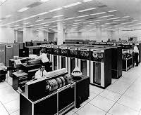
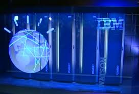
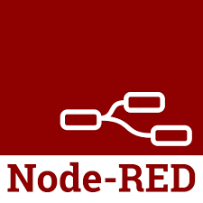
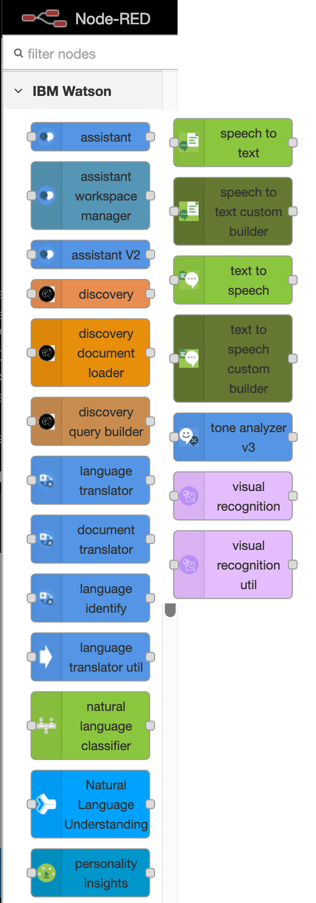
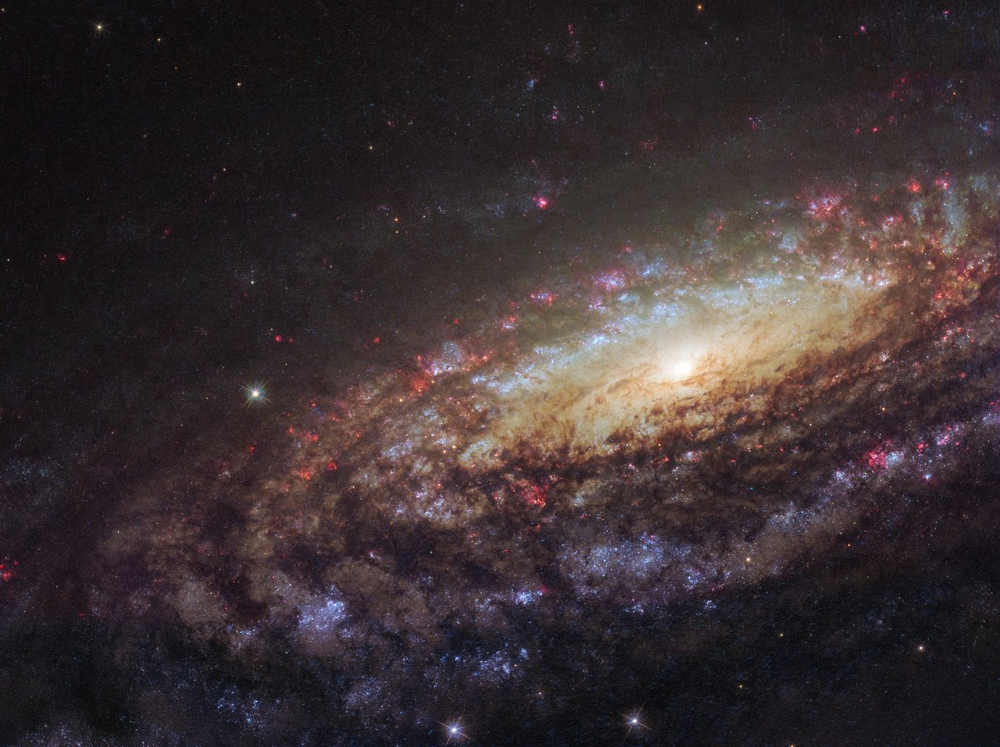
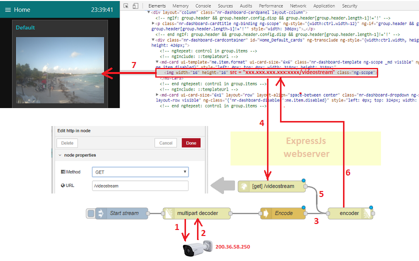

# IBM Watson and Node-RED

## Presentation is on GitHub  https://bit.ly/2GruOrb






#### from chess, to jepordy to `debate`


#### getting started with Watson
https://ibm.co/2Hlmnuy


#### Watson showed in Node-RED


#### Watson catalog items on Node-RED



#### visual recognition
https://ibm.co/2T1LFqB




```sh
sh-3.2$ curl -u "apikey:Sm1O0N-Y11PfK5j9TmJ8uU1tGSxcxpRqPQHEWga5MWBD" "https://gateway.watsonplatform.net/visual-recognition/api/v3/classify?url=http://cdn.spacetelescope.org/archives/images/screen/potw1805a.jpg&version=2018-03-19"
{
    "images": [
        {
            "classifiers": [
                {
                    "classifier_id": "default",
                    "name": "default",
                    "classes": [
                        {
                            "class": "interstellar space",
                            "score": 0.894
                        },
                        {
                            "class": "supernova",
                            "score": 0.615
                        },
                        {
                            "class": "pulsar star",
                            "score": 0.579,
                            "type_hierarchy": "/nature/pulsar star"
                        },
                        {
                            "class": "nature",
                            "score": 0.579
                        },
                        {
                            "class": "intergalactic space",
                            "score": 0.5
                        },
                        {
                            "class": "purple color",
                            "score": 0.639
                        }
                    ]
                }
            ],
            "source_url": "http://cdn.spacetelescope.org/archives/images/screen/potw1805a.jpg",
            "resolved_url": "http://cdn.spacetelescope.org/archives/images/screen/potw1805a.jpg"
        }
    ],
    "images_processed": 1,
    "custom_classes": 0
}
```


#### lets try it out.
basics - demo it

#### read live tweets
https://bit.ly/2X8KuVw

#### websocket chat app
https://ibm.co/2SHrWNy

#### tweet my weather at my location googlemaps 
https://bit.ly/2NdCMEY

#### encoding multipart streams over http



https://bit.ly/2GyAHTF

### run Node-RED on Raspberry PI?
[my notes](./PI.README.md)

[official instructions](https://bit.ly/2i8C3K8) - ```https://bit.ly/2i8C3K8 ```

## resources
Node-RED user guide

https://bit.ly/2GMF50q

Node-RED cookbook

https://bit.ly/2S6ildR

signup for free lite IBM Cloud account
https://ibm.co/2N3x4p5

apply promo to ibm account

https://bit.ly/2TOeEv6

#### The Presenter: 
```
Grant Steinfeld
IBM Developer Advocate Blockchain / Java / NodeJS
North America East

   Twitter        @gsteinfeld
 
   Blog:          https://medium.com/@grantsteinfeld     
   GitHub:        https://github.com/grant-steinfeld
   LinkedIn:      https://linkedin.com/in/grant-steinfeld
   ...            https://GrantSteinfeld.com
   ```

