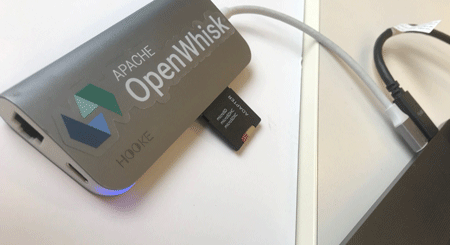
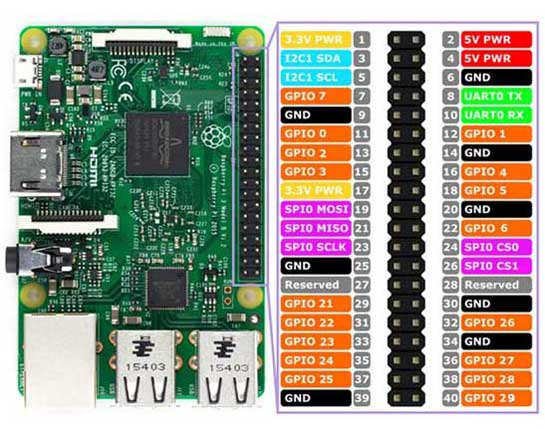

# IBM Developer Advocay
## Node-RED Watson Workshop

### What you will need

 Raspberry Pi 3 - Model B

micro SD card 32 Mb
with some kind of adapter to connect to Laptop



 [SD Memory Card Formatter  - https://bit.ly/1alC3Wp ](https://www.sdcard.org/downloads/formatter_4/)
 download for Mac / Windows (3.5Mb)

 Do a full format of your SD card ( no quick format! )

 Get Raspian Stretch with desktop (1.08Gb)

 2nd link down

 https://www.raspberrypi.org/downloads/raspbian/

2018-11-13-raspbian-stretch.zip

expand it to get and .img file

2018-11-13-raspbian-stretch.img

use Etcher to fash os images to SD card
https://www.balena.io/etcher/

easy peasy!

now insert the recently flashed microsd card into your pi 

start!

look for your ip address

l. hook up USB mouse/keyboard and HDMI

or if headless use nmap ( brew install nmap )

```sh
nmap -v -sn 192.168.0.0/16 10.0.0.0/8
nmap -v -sn 9.66.212.0/16 
```
hard to do if lots of computers on network

9.66.212.170

### what pins are what?
https://bit.ly/2EaADqL


### connect something to the pins
e.g. a RGB led
### vnc server and client if headless


### install node-red on pi
once on a terminal on your pi check out this how-to:

[https://bit.ly/2i8C3K8](https://nodered.org/docs/hardware/raspberrypi)

```sh
bash <(curl -sL https://raw.githubusercontent.com/node-red/raspbian-deb-package/master/resources/update-nodejs-and-nodered)

```


### run node-RED on IBM Cloud
#### create cloud account and login

### demo examples

#### hello world to debug window

#### hello world to browser

#### on the pi itself
gpio pins
[https://bit.ly/2TSgnPM](https://projects.raspberrypi.org/en/projects/getting-started-with-node-red/4)

#### websocket chat app
https://ibm.co/2SHrWNy

#troubleshooting
can you connect to your pi via ssh? it's disabled by default

https://www.raspberrypi.org/documentation/remote-access/ssh/

